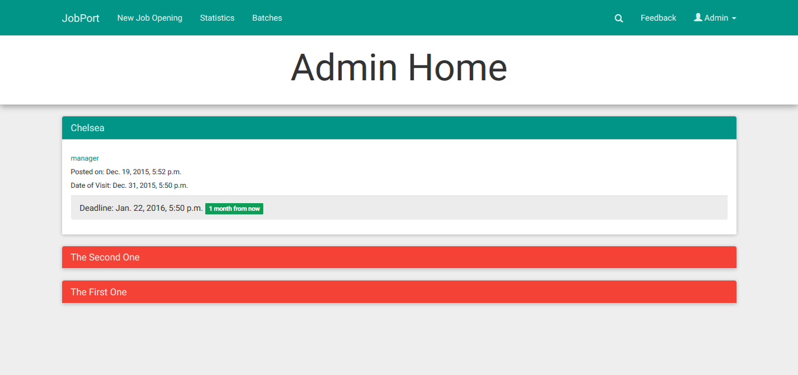
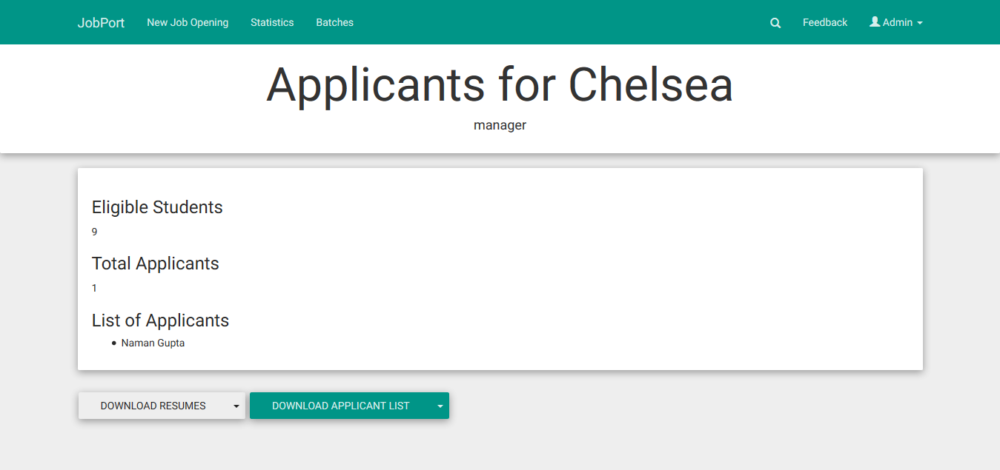

JobPort
=========

http://jobport.iiitd.edu.in:8081

JobPort was a project undertaken by students at IIIT - Delhi. It is a Platform for Colleges and Institutes, for placement purposes. The Portal is currently being used inside IIIT - Delhi actively and is open for development and use.

The project was developed in the care of Byld (Software Development Club) http://byld.iiitd.edu.in
The Documentation can be found at http://jobport.rtfd.org/.

Read the Wiki https://github.com/IIIT-Delhi/placement/wiki to set up your local development environment. PRs are welcome!

# Screenshots:

1. Manage jobs, students here. Red job means the deadline is over, green means it is still open. 

2. See all the batches here, edit them or create one.

3. Create a new batch.

4. Edit a batch, view students in the batch.

5. Open a Job.

6. Any student can sign up easily.

7. Student homepage - access to their job applications, edit their profile.

8. Edit profile

9. Apply for Job.

10. Admin can edit Job details.

11. See your applications.

12. Admin can see statistics, information about unpplaced, blocked students.

13. Admin can view job applicants.

14. Admin can select job applicants.

15. Admin can update student CGPA.

16. Admin can search any student, batch or job.

17. Feedback to developer.

